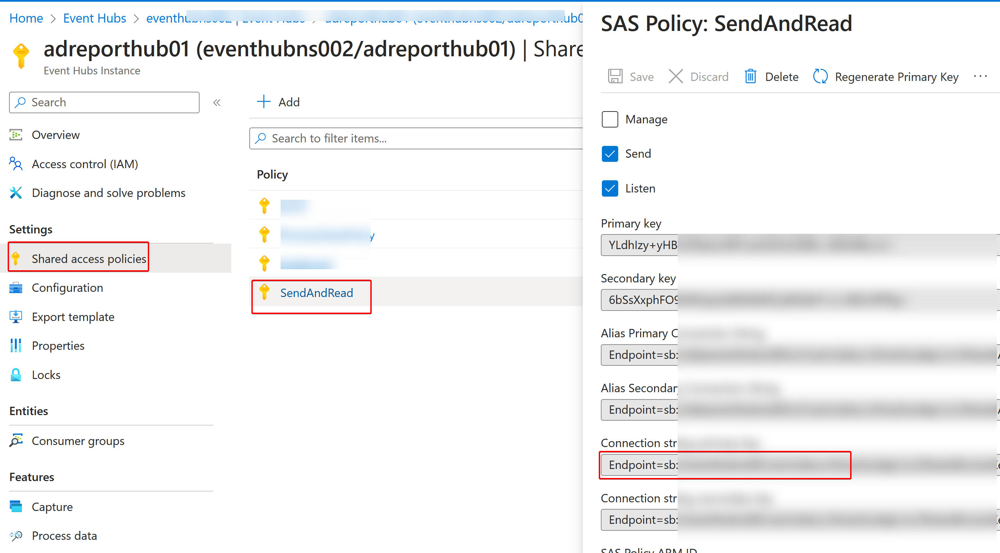

# APIM-AOAI-Proxy

Setup APIM as Azure OpenAI proxy, capture tokens and store at DB for reporting. **APIM can be created and configured at Global Azure or sovereign cloud (e.g. Azure operated by 21Vianet)**. This article illustrated using 21Vianet Azure cloud host APIM for the solution, if you host APIM at global Azure, the steps should be almost the same.

In terms of Azure OpenAI stream call, this solution **supports APIM to capture stream response payload** and calculate the tokens at downstream Function API tier, however enable APIM capture stream response payload will seriously impact end-user experience because the Server-send event (SSE) stream has to be cached at APIM for payload capture before APIM forward the flow to client, therefore client will NOT see instant response flow from stream, but will wait untill the response returned as whole at the end. In other words, the behavior become like sychronized call rather than stream call.

This solution also **supports disable stream capture at APIM**, which provide streaming experience for end-user, however in this case APIM will only caputre and calculate request payload tokens, the respones payload will not be captured and calculated.

## Environment Preparation

### Tool Machine

- Install [Python](https://www.python.org/downloads/) into tool machine, here use v3.11
- Install VSCode
  - Install [Python extension](https://marketplace.visualstudio.com/items?itemName=ms-python.python).
  - Install **Azure Account** extension. (**NOTE**: Refer to [this KB](https://docs.azure.cn/zh-cn/articles/azure-operations-guide/others/aog-others-howto-login-china-azure-by-vscode) for how to configure Vscode for login Sovereign Cloud. e.g. Azure China)
  - Install **[Azure Resources](https://marketplace.visualstudio.com/items?itemName=ms-azuretools.vscode-azureresourcegroups)** extension. Please use v0.75 rather than v0.80(preview) as v0.80 has bug and unable support sovereign cloud login at the moment I write this blog.
  - Install **Azure Function** extension.
  - Install **Azure API Management** extesion.

### Azure OpenAI

- Create Azure OpenAI instance at corresponding region
- Deploy all models needed for business
- Remeber Azure OpenAI instance endpoint (_`https://<aoai_endpoint_name>.openai.azure.com/`_) and access key _`<aoai_endpoint_access_key>`_ which will be used later

### Proxy Tier (Azure Resources)

Login Azure portal and create following resources, here use Azure China as example, use Global Azure will be technically the same.

- **API Management**: Choose Developer tier or other tiers denpends on your environment and VNET integration needs, but don't choose consumption tier.
- **Event Hub**: Any tier can be chosen.
- **Function App**: Create Azure Function App resource with below configuration
  - _Runtime stack_ - Python
  - _Version_ - 3.11
  - _Operating System_ - Linux
  - _Hosting Plan_ - any plan except Consumption plan
- **SQL Database**: Any SKU can be chosen depends on your workload, meanwhile configure appropriate firewall rule which can allow access from your Azure Function App, your tool machine, as well as Power BI service.

## Environment Setup

### SQL Database

- login the SQL Database we just created via SSMS, and execute [SQL script](DBScript/aoaieventdb.sql) to create table schema.
- There is partial of model pricing rate information provisioned into tabel **AoaiTokenRate**, you can update or provision your own version according to your model name and corresponding price.

### Event Hub

- Go to the Event Hub Namespace which just created at above steps, create a event hub instance
- Click **Shared access policies** of the instance, create a SAS Policy and give **Send** and **Listen** policy, remember the **connection string** for later use.
  

### APIM

- Use below PowerShell cmdlet to create API Management logger. Detail information can refer to [How to log events to Azure Event Hubs in Azure API Management](https://learn.microsoft.com/en-us/azure/api-management/api-management-howto-log-event-hubs?tabs=PowerShell)

```PowerShell
# API Management service-specific details
$apimServiceName = "<Your APIM name>"
$resourceGroupName = "<Your APIM resource group>"

# Create logger
$context = New-AzApiManagementContext -ResourceGroupName $resourceGroupName -ServiceName $apimServiceName
New-AzApiManagementLogger -Context $context -LoggerId "event-hub-logger" -Name "<your event hub name>" -ConnectionString "<your event hub connection string>" -Description "Event hub logger with connection string"
```

(**NOTE**: Make sure LoggerId set to **event-hub-logger**,otherwise you will need change loggerId in APIM policy at later steps accordingly)

- Import OpenAI swagger file.
