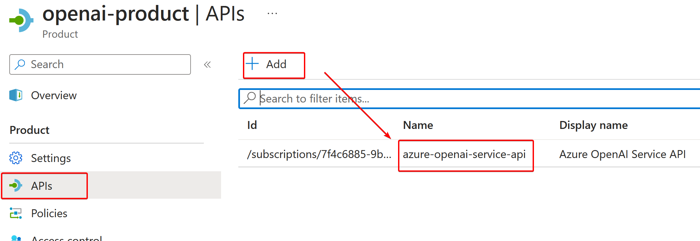

# APIM-AOAI-Proxy

Setup APIM as Azure OpenAI proxy, capture tokens and store at DB for company internal billing cross charge. **APIM can be created and configured at Global Azure or sovereign cloud (e.g. Azure operated by 21Vianet)**. This article illustrated using 21Vianet Azure cloud host APIM for the solution, if you host APIM at global Azure, the steps should be almost the same. Following is the high level architecture.  
  
In terms of Azure OpenAI stream call, this solution **supports APIM to capture stream response payload** and calculate the tokens at downstream Function API tier, however enable APIM capture stream response payload will seriously impact end-user experience because the Server-send event (SSE) stream has to be cached at APIM for payload capture before APIM forward the flow to client, therefore client will NOT see instant response flow from stream, but will wait untill the response returned as whole at the end. In other words, the behavior become like sychronized call rather than stream call.

This solution also **supports disable stream capture at APIM**, which provide streaming experience for end-user, however in this case APIM will only caputre and calculate request payload tokens, the respones payload will not be captured and calculated.

## Environment Preparation

### Tool Machine

- Install **[Python](https://www.python.org/downloads/)** into tool machine, here use v3.11
- Install **[VSCode](https://code.visualstudio.com/download)**, and then
  - Install **[Python extension](https://marketplace.visualstudio.com/items?itemName=ms-python.python)**.
  - Install **[Azure Account](https://marketplace.visualstudio.com/items?itemName=ms-vscode.azure-account)** extension. (**NOTE**: Refer to [this KB](https://docs.azure.cn/zh-cn/articles/azure-operations-guide/others/aog-others-howto-login-china-azure-by-vscode) for how to configure Vscode for login Sovereign Cloud. e.g. Azure China)
  - Install **[Azure Resources](https://marketplace.visualstudio.com/items?itemName=ms-azuretools.vscode-azureresourcegroups)** extension. Please use v0.75 rather than v0.80(preview) as v0.80 has bug and unable support sovereign cloud login at the moment I write this blog.
  - Install **[Azure Function](https://marketplace.visualstudio.com/items?itemName=ms-azuretools.vscode-azurefunctions)** extension.
  - Install **[Azure API Management](https://marketplace.visualstudio.com/items?itemName=ms-azuretools.vscode-apimanagement)** extesion(Optional).
- Install **[Power BI desktop](https://www.microsoft.com/en-us/download/details.aspx?id=58494)**

### Azure OpenAI

- Create Azure OpenAI instance at corresponding region
- Deploy all models needed for business
- <a name="anchor1"></a>Remeber Azure OpenAI instance endpoint (_`https://<aoai_endpoint_name>.openai.azure.com/`_) and access key _`<aoai_endpoint_access_key>`_ which will be used later

### Proxy Tier (Azure Resources)

Login Azure portal and create following resources, here use Azure China as example, use Global Azure will be technically the same.

- **API Management**: Choose Developer tier or other tiers denpends on your environment and VNET integration needs, but don't choose consumption tier.
- **Event Hub**: Any tier can be chosen.
- **Function App**: Create Azure Function App resource with below configuration
  - _Code or Container Image_ - Code
  - _Runtime stack_ - Python
  - _Version_ - 3.11
  - _Operating System_ - Linux
  - _Hosting Plan_ - any plan except Consumption plan
  - _Monitoring_ - Set Application Insights enabled and configured
- <a name="anchor5"></a>**SQL Database**: Create a SQL database with name **_aoaieventdb_**, any SKU can be chosen depends on your workload, meanwhile configure appropriate firewall rule which can allow access from your Azure Function App, your tool machine, as well as Power BI service.

## Environment Setup

### SQL Database

- login the SQL Database we just created via SSMS, and execute [SQL script](DBScript/aoaieventdb.sql) to create table schema.
- There is partial of model pricing rate information provisioned into table _**AoaiTokenRate**_, you can update or provision your own version according to your model name and corresponding price.

### Event Hub

- <a name="anchor3"></a>Go to the Event Hub Namespace which just created at above steps, create a event hub instance, remeber instance name for later use.
- <a name="anchor4"></a>Click **Shared access policies** of the instance, create a SAS Policy and give **Send** and **Listen** policy, remember the **connection string** for later use.  
  
- <a name="anchor10"></a>Click **Consumer group**, and create a new consumer group with name **_apim_aoai_eventhub_consumer_group_**.
  

### APIM

- <a name="anchor2"></a>Use below PowerShell cmdlet to create API Management logger. Detail information can refer to [How to log events to Azure Event Hubs in Azure API Management](https://learn.microsoft.com/en-us/azure/api-management/api-management-howto-log-event-hubs?tabs=PowerShell)

  ```PowerShell
  # API Management service-specific details
  $apimServiceName = "<Your APIM name>"
  $resourceGroupName = "<Your APIM resource group>"

  # Create logger
  $context = New-AzApiManagementContext -ResourceGroupName $resourceGroupName -ServiceName $apimServiceName
  New-AzApiManagementLogger -Context $context -LoggerId "event-hub-logger" -Name "<your event hub namespace name>" -ConnectionString "<your event hub connection string>" -Description "Event hub logger with connection string"
  ```

  (**NOTE**: Make sure LoggerId set to _**event-hub-logger**_,otherwise you will need change loggerId in APIM policy at later steps accordingly)

- Open [this github folder](https://github.com/Azure/azure-rest-api-specs/tree/main/specification/cognitiveservices/data-plane/AzureOpenAI/inference/stable) via browser, click into latest version folder (**2023-05-15** is the latest version folder when write this blog).
- Download the **inference.json** to tool machine. - Open **inference.json** in vscode at tool machine, change the **servers** property to make the **url** and **endpoint** properties pointing to your Azure OpenAI API instance [created previously](#anchor1).
  ```JSON
    "servers": [
      {
      "url": "https://<aoai_endpoint_name>.openai.azure.com/openai",
      "variables": {
          "endpoint": {
          "default": "<aoai_endpoint_name>.openai.azure.com"}
          }
      }
    ],
  ```
- Import the updated **inference.json** file in APIM as below capture, select **API**, then choose **Add API**, click **OpenAPI**
  
- At Create from OpenAPI specification page, choose **Full**, select and import **inference.json**, set _**openai**_ at API URL suffix field. click **Create** button.  
  
- When the import creation complete, click **setting**, rename the subscription key verification header as **api-key**.

   

- Create a named value for your Azure OpenAI API key. To creat a named value, see [using named values in Azure API Management polices](https://learn.microsoft.com/en-us/azure/api-management/api-management-howto-properties?tabs=azure-portal). Take note of the Display name you give your named value as it is needed in next steps. Here we set the name display name as _**azure-openai-key**_. set the Type as **Secret**, and set the secret value as your Azure OpenAI endpoint access key _`<aoai_endpoint_access_key>`_ which created at [previous step](#anchor1)  
  
- Similarly, add another named value with Name and Display name as _**capture-streaming**_,set the Type as **Plain**, set the value as _**True**_  
  **NOTE**: You can set it to _**False**_ if you want to only capture streaming _request_ playload without capturing _response_ payload, this will give end-user real streaming experience.  
  
- Go to **Products** at APIM blade menu add a new product with name **_openai-product_**.
- Click into the newly created product, add the imported OpenAI APIs into the product.

  

- And also add necessary **_subscription_** for APIM API call key authentication.

  

  (**NOTE**: you can add multiple subscriptions, each subscription can be assigned to individual end-user for calling OpenAI API via this APIM instance)

- Select each **subscription** and **show the key**, note the key and share with corresponding end-user, this key will work as **_OpenAI access key_** for OpenAI API call via APIM.

  

- Click **Policies** in this Product, and then click the **edit policy icon** as below capture

  

- Copy all the policies from [this policy file](<APIM_Product_Policy/TokenCaptureProduct(parent).xml>), and paste into current policy edit page content, and **Save** the policy

  

  **NOTE**: If you configured different API Management logger name at [previous step](#anchor2), you should update all relavant logger-id at all \_logger-id="**event-hub-logger**"\* accordingly before Save.

- Try OpenAI API call via APIM by Postman or OpenAI SDK with following information
  - **azure_endpoint**: Use your APIM gateway URL, e.g _https://\<apim-name\>.azure-api.cn/_ (Azure China) or _https://\<apim-name\>.azure-api.net_ (Global Azure)
  - **api_key**: Use your APIM subscription key
  - **model**: Use your Azure OpenAI model **deployment name** (_NOTE_: Suggest to set deployment to be same as model name)
  - **api_version**: Use any version that Azure OpenAI supported
- <a name="anchor7"></a>After successful Opena API call test, go to event hub and check **Incoming Message** Metrics, if metric indicates message came in, it means API call had been successfully captured by APIM and delivered to eventhub

  

### Function App

- Clone this repository onto tool machine local, and open with VScode.
- <a name="anchor8"></a>Open [function_app.py](function_app.py) and go to line 53, find parameter **_event_hub_name="\<event hub instance name\>"_** and set the parameter value as your event hub instance name that created at [previous step](#anchor3). Then save the file.
- Open [local.settings.json](local.settings.json) file, set value of **AOAI_APIM_EVENTHUB_CONNECTION** as your event hub instance connection string which created at [previous step](#anchor4). Similarly, set value of **AOAI_DB_STORE_CONNECTION** as your SQL DB connection string which created at [previous step](#anchor5), privode corresponding _**server name**_, _**DB name**_, _**user name**_ and **_password_** in the connection string.

  

- Click **Azure** extension, click **RESOURCES** extension, log into your Azure subscription, choose the Function App which created previously, and choose **Deployment to Function App** as below capture

  

- <a name="anchor9"></a>Wait for deployment complete, and click **Upload settings** at the popup windows at the end of deployment as below capture.

  

  **NOTE**: If you prefer to use CI/CD to deploy Azure Function App, please refer to [GitHub Actions for deploying to Azure Functions](https://github.com/Azure/functions-action).

- Try OpenAI call via postman or SDK, wait for a few seconds and then check the table **ApimAoaiToken** in your SQL DB to see if the token capture records flow through.

### Power BI report

- Open **[AOAI_Token_Billing_20231205.pbix](PBIReport/AOAI_Token_Billing_20231205.pbix)** file with Power BI desktop. Click **Cancel** if there is any login window pop up untill all visuals loaded.

  

- click **Transform data**, then click **Data source settings**.

  

- click the data source, and then click **Change Source**, provide your SQL database server name and db name, as well as the authentication information.

  

- Then click **Edit Permission** to update login account

  

- After DB connection updated, make sure all the visual can be correctly loaded. then click **File**, choose **Publish** to publish the report to your PBI service portal.
- Load the report at PBI service, check if the report loaded correctly as following capture.

  

### Troubleshooting

1. **There is no cost calculated in the report**

   - please make sure all the model/deployment name you used in your environment match with the model name defined in _**AoaiTokenRate**_ table.

   

2. **Power BI report rendering is slow**
   - Power Bi report currently is using Direct Query mode instead of Import. so when more data flowed into SQLDB, PBI report query worload agains SQLDB will increase, you can consider **scale up** SQLDB or change the report from **DQ to Import mode**.
3. **Power BI report cannot be loaded**
   - Check SQLDB credential at report dataset setting page at PBI service portal.
   - Check firewall setting at SQLDB.
4. **No data captured into SQLDB**

   - Check event hub metrics as [this previous step](#anchor7) to see if message was captured at APIM and sent to eventhub. If not, check and make sure your [APIM logger configuration](#anchor2) is correct, as well as appropriate network firewall setting at eventhub.
   - Make sure the eventhub connection string at Application setting (which was uploaded at [this step](#anchor9)) .
   - Make sure event hub name defined in Function app python code is correct as [this step](#anchor8).
   - Make sure consumer group **_apim_aoai_eventhub_consumer_group_** is created at event hub as [this step](#anchor10), and same as the name defined at line 54 of [function_app.py](function_app.py).
   - Make sure SQLDB has appropriate firewall rule for allowing Function App access.
   - At Function App, enable application insight and Diagnostic Settings (send **FunctionAppLogs** to Log Analytics workspace). and then open **log stream** at Function App and switch to **Filesystem log**, perform OpenAI SDK call, and observe if any exception throw at log stream.

      

   - In addition, go to corresponding Application Insight and Log Analytics workspace to check any exception raised.

\<End>
